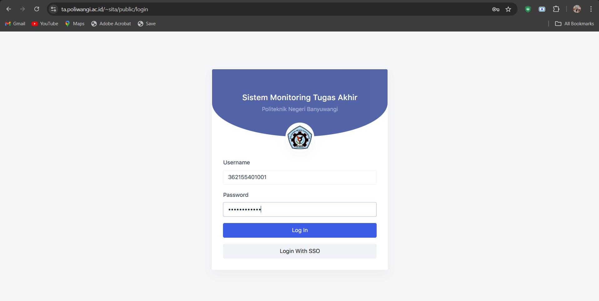

## SISTEM MONITORING TUGAS AKHIR (SITA)
Sistem Monitoring Tugas Akhir merupakan sistem informasi yang digunakan untuk mempermudah dalam pengelolaan tugas akhir dari mahasiswa semester akhir.

# Menu
1. Landing Page 
2. Dashboard
3. Profile
4. Master Data
    - Jurusan
    - Program Studi
    - Mahasiswa
    - Dosen
    - Topik
    - Ruangan
    - Jenis TA
    - Kuota Dosen
    - Kategori Nilai
5.	Periode TA
6.	Tugas Akhir
    - Daftar TA
    - Jadwal Seminar
7.	Manajemen Pengguna
    - Pengguna
    - Role
8.	Pengaturan
    - Aplikasi
9.	Tawaran Tugas Akhir
10.	Daftar Bimbingan
11.	Pengajuan TA
12.	Pembagian Dosen

# Role
1. Admin
2. Kajur
3. Kaprodi
4. Dosen
5. Mahasiswa

# Cara Penggunaan
1.	Tautan SITA: https://ta.poliwangi.ac.id/~sita/public
2.	Login
    Untuk mengakses Sistem Monitoring Tugas Akhir, pengguna harus melakukan login sesuai dengan peran dan kredensial masing-masing. Masukkan Username dan Password menggunakan NIM (untuk Mahasiswa) atau NIDN (untuk Dosen/Kajur/Kaprodi)
    
3.	Ketika User login sebagai Dosen, user dapat menambahkan tawaran tugas akhir melalui tombol “tambah” yang terdapat pada menu Tawaran Tugas Akhir.
    
